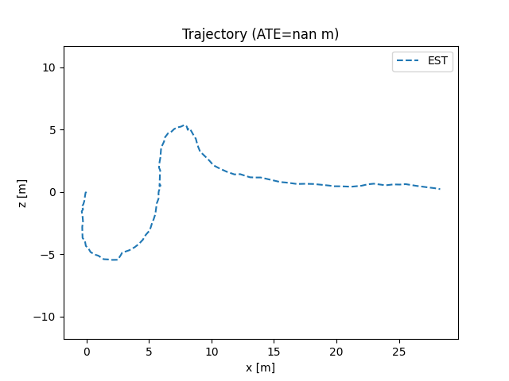

# Moge2_VO
# MoGe2 Visual Odometry (MoGe2_VO)

This repository implements a simple **Visual Odometry (VO)** pipeline built on top of **MoGe2** monocular depth predictions.  
It generates metric point maps using MoGe2, aligns consecutive frames with **RANSAC + Open3D ICP**, and reconstructs a trajectory.

---

## 📦 Setup

### 1. Clone this repo
```bash
git clone https://github.com/Smshah30/Moge2_VO.git
cd Moge2_VO
```

### 2. Install MoGe2
Clone and set up the [MoGe2](https://github.com/microsoft/MoGe) repository following its installation instructions.  
Make sure you can run inference with MoGe2 and generate point maps.

```bash
pip install git+https://github.com/microsoft/MoGe.git
```

#### Or clone repository
```bash
git clone https://github.com/microsoft/MoGe.git
cd MoGe
pip install -r requirements.txt   # install the requirements
```
### 3. Download Dataset (KITTI Odometry or Any Of Your Choice)
### 4. Requirements
```bash
pip install open3d
pip install yt-dlp # To download youtube Videos
sudo apt-get install ffmpeg # Necessary before install videos
```

## Usage

### 1. Create `.npz` files for each image
It stores the metric points, affine-inv points, normals, depth, mask and normalized intrinsics

```bash
python3 test_k.py --data_dir ~/datasets/kitti/dataset/sequences/00/image_0/ --ext png --save_path ~/numpies/ --max_images 30 # max_images for a quick run
```

### 2. Estimate poses with RANSAC + ICP

```bash
python3 ransac_open3d_icp_vo.py  --seq_dir ~/numpies/  --out_poses poses/pose.txt --levels 3 --iters 10 7 5 --subsample 8 --max_corr 20000 --use_first_K
```
`--use_first_K` is useful when the standard deviation (std) in scale at the end of step 1 is high. This ensures that the model keeps the Intrinsics Constant

### 3. Compare Results or View Trajectory
```bash
python3 eval_kitti.py  --gt_poses ~/kitti/dataset/poses/00.txt --est_poses poses_v2.txt --save_plot vid2_est.png
```
`--gt_poses` is optional 


##Results

#### Observations
- Generally for KITTI dataset the scale remained pretty consistent. Hence, no need to extract Affine-Inv points.
- Intrinsics however were inconsistent for consecutive frames.
  - For KITTI dataset, though there were wobles in K, in the end the ATE was less for Dynamic K rather than a Constant K.
  - For Drone videos, having Constant K `--use_first_K` helped the final result to be less shaky.
- Surprising, initially ICP+RANSAC gave pretty good result APE <=2 . However, at the end of the dataset the ATE increased to 303 (MAIN REASON FOR THE DELAY)

#### Images


#### Drone Video 1 ( Cut from `1:49` to `2:55`) [Video1](https://www.youtube.com/watch?v=8zJ5wv6NIlY)


#### Drone Video 3 ( Cut from `0:39` to `1:05`) [Video2](https://www.youtube.com/watch?v=4zWq3pkJ8NI)
Constant K


Dynamic K


#### Drone Video 3 [Video3](https://www.youtube.com/watch?v=Zwa5i1yZu7w)
Constant K


Dynamic K


#### Conclusion
- For some reason the results on KITTI are worse then that with just Visual Odometry that I have acheived in past.
- It is better to have Constant K for drone videos (scale std was >0.2 compared to 0.08-0.02 for KITTI)
- Dynamic K helps with stable videos.


